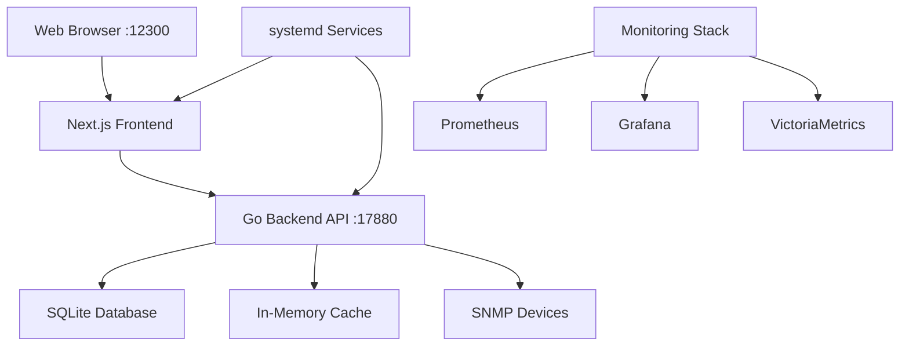

# 🌐 SNMP Network Monitoring Platform (SQLite Edition)

<div align="center">

[](https://opensource.org/licenses/MIT)
[](https://nextjs.org/)
[](https://www.typescriptlang.org/)
[](https://golang.org/)
[](https://sqlite.org/)
[](#)

**[🇨🇳 中文](README.md) | [🇺🇸 English](README_EN.md)**

</div>

> 🚀 **Enterprise-grade SNMP network device monitoring and management platform** - Lightweight network device monitoring and management solution using SQLite database and in-memory caching, supporting zero-configuration quick deployment without Docker and external database dependencies.

## ✨ Key Features

- 🗃️ **SQLite Database** - No external database required, file-based storage
- 💾 **In-Memory Caching** - High-performance caching system, no Redis needed
- 🚀 **Zero-Configuration Deployment** - One-click startup, no Docker required
- 📱 **Responsive Design** - Support for desktop and mobile devices
- 🌐 **Multi-language Support** - Chinese/English interface
- 🔒 **Security Authentication** - JWT authentication and permission management
- 📊 **Real-time Monitoring** - SNMP device monitoring and alerting
- 🔧 **Configuration Management** - Device templates and batch configuration

### 🎯 **Complete Monitoring Functions**
- 📊 **Device Discovery & Management** - Auto-discover and manage network devices, supporting Cisco, Huawei, H3C and other major vendors
- 📈 **Real-time Monitoring** - SNMP-based real-time data collection with v1/v2c/v3 support
- 🚨 **Intelligent Alerting** - Multi-system alert deployment for Prometheus, VMAlert, and Alertmanager
- 📁 **MIB Management** - Complete MIB file management and OID browser
- ⚙️ **Configuration Automation** - Auto-generate configurations for SNMP Exporter, Categraf, and VictoriaMetrics

### 🏭 **Production-Grade Features**
- 🔐 **Multi-user Support** - Complete user permission management system
- 🌐 **Multi-language Interface** - Support for Chinese and English
- 📱 **Responsive Design** - Perfect support for desktop and mobile devices
- 🎨 **Modern UI** - User interface based on latest design standards
- 🚀 **High Performance** - Optimized database queries and in-memory caching strategy

### 🛠️ **DevOps Integration**
- 🔄 **Automated Operations** - SSH remote configuration deployment and component management
- 📊 **Monitoring Components** - Integrated Node Exporter, SNMP Exporter, Categraf, etc.
- 🔧 **Batch Operations** - Support for batch device management and configuration deployment
- ⚙️ **systemd Management** - Complete systemd service configuration and management

### 🔧 **Technology Stack**
- **Frontend**: Next.js 15 + React 19 + TypeScript + Tailwind CSS + shadcn/ui
- **Backend**: Go 1.23 + Gin + GORM + SQLite
- **Monitoring Integration**: Prometheus + VictoriaMetrics + VMAlert + Alertmanager + Grafana
- **Collectors**: SNMP Exporter + Node Exporter + Categraf (Nightingale Monitoring)
- **Deployment**: Binary + systemd + SSH Automation
- **Database**: SQLite 3 + In-memory caching optimization

## 🚀 Quick Start

### 📋 System Requirements

- **Operating System**: Linux / macOS / Windows
- **Node.js**: 18+ 
- **Go**: 1.21+
- **Memory**: Minimum 512MB, Recommended 1GB+
- **Storage**: Minimum 1GB available space

### ⚡ One-Click Deployment

```bash
# 1. Clone the project
git clone https://github.com/evan7434/snmp-mib-ui.git
cd snmp-mib-ui

# 2. Choose deployment method
# Method 1: Simple deployment (Recommended)
./deploy-simple.sh

# Method 2: No-Docker deployment
./deploy-local-no-docker.sh

# Method 3: systemd service deployment
sudo ./install-systemd-services.sh
```

### 📱 Access URLs

After deployment, you can access the system through the following URLs:

| Service | URL | Description |
|---------|-----|-------------|
| 🌐 **Web Interface** | http://localhost:12300 | Main management interface |
| 🔌 **API Interface** | http://localhost:17880/api/v1 | RESTful API |
| 🏥 **Health Check** | http://localhost:12300/api/health | System status check |

### 🔧 Service Management

#### Script-based Management

```bash
# Start all services
./start-services.sh

# Stop all services
./stop-services.sh

# View frontend logs
tail -f frontend.log

# View backend logs
tail -f backend.log

# Restart services
./stop-services.sh && ./start-services.sh
```

#### systemd Service Management

```bash
# Install systemd services
sudo ./install-systemd-services.sh

# Start platform services
sudo systemctl start snmp-mib-platform.target

# Stop platform services
sudo systemctl stop snmp-mib-platform.target

# Check service status
sudo systemctl status snmp-mib-platform.target

# Check individual component status
sudo systemctl status snmp-mib-backend.service
sudo systemctl status snmp-mib-frontend.service

# Enable auto-start on boot
sudo systemctl enable snmp-mib-platform.target

# View service logs
sudo journalctl -u snmp-mib-backend.service -f
sudo journalctl -u snmp-mib-frontend.service -f
```

## 📖 Features Overview

### 🎛️ Core Functional Modules

#### 📊 Device Management (`/devices`)
- **Device Discovery**: Auto-scan and discover SNMP devices in the network with IP range scanning
- **Device Registration**: Manual device addition and batch import with Excel/CSV support
- **Status Monitoring**: Real-time display of device online status and key metrics
- **Group Management**: Group devices by network segment, type, vendor, or purpose
- **Vendor Support**: Specially optimized support for Cisco, Huawei, H3C, Juniper and other mainstream devices

#### 📁 MIB Management (`/mibs`)
- **File Upload**: Support drag-and-drop MIB file upload with automatic MIB tree structure parsing
- **Parse Validation**: Automatically parse MIB files and validate syntax correctness
- **OID Browser**: Tree structure display of OID hierarchical relationships with search and filtering
- **Multi-vendor MIBs**: Built-in standard MIB libraries for Cisco, Huawei, H3C and other vendors

#### ⚙️ Configuration Generation (`/config-gen`)
- **SNMP Exporter Configuration**: Auto-generate monitoring configurations for different vendors
- **Categraf Configuration**: Generate Nightingale monitoring collector configuration files
- **Prometheus Configuration**: Generate Prometheus scrape job configurations
- **Alert Rules**: Generate corresponding alert rule templates based on device types
- **Configuration Validation**: Built-in configuration syntax checking and best practice recommendations

#### 🚨 Alert Management (`/alert-rules`)
- **Rule Editor**: Visual PromQL rule writing with syntax highlighting
- **Multi-system Deployment**: Support alert rule deployment for Prometheus, VMAlert, and Alertmanager
- **Notification Configuration**: Support for email, DingTalk, Enterprise WeChat, Slack and other notification methods
- **Alert Templates**: Provide commonly used alert rule template library for network devices
- **Batch Operations**: Support batch enable/disable of alert rules

#### 🔧 Monitoring Installation (`/monitoring-installer`)
- **Component Management**: Manage Node Exporter, SNMP Exporter, Categraf and other monitoring components
- **Remote Deployment**: Auto-deploy monitoring components to remote hosts via SSH
- **Configuration Sync**: Automatically sync monitoring configurations to target hosts
- **Service Status**: Real-time monitoring of deployed component running status
- **Version Management**: Support monitoring component version upgrades and rollbacks

#### 🛠️ Batch Operations (`/tools/bulk-ops`)
- **Batch Configuration**: Batch modify device SNMP configuration information
- **Batch Deployment**: Batch deploy monitoring configurations to multiple devices
- **Batch Testing**: Batch test device connectivity and SNMP availability
- **Operation Logs**: Complete batch operation logs and result tracking

#### 📈 Real-time Monitoring (`/monitoring`)
- **Metric Queries**: Real-time query of device monitoring metric data
- **Chart Display**: Dynamic charts displaying device performance trends
- **Threshold Alerts**: Custom metric thresholds and alert conditions
- **Data Export**: Support monitoring data export in CSV/JSON formats

## 🏗️ Architecture Design

### 📁 Project Structure

```
snmp-mib-ui/
├── app/                    # Next.js app directory
│   ├── api/               # API routes
│   ├── devices/           # Device management pages
│   ├── mibs/              # MIB management pages
│   ├── config-gen/        # Configuration generation pages
│   ├── alert-rules/       # Alert rules pages
│   ├── monitoring-installer/ # Monitoring installer pages
│   ├── tools/             # Tool pages
│   └── monitoring/        # Real-time monitoring pages
├── backend/               # Go backend service
│   ├── controllers/       # Controllers
│   ├── models/           # Data models
│   ├── services/         # Business logic
│   └── utils/            # Utility functions
├── components/            # Shared components
├── lib/                  # Utility library
├── systemd/              # systemd service configuration
├── data/                 # SQLite database files
├── logs/                 # Application logs
├── deploy-simple.sh      # Simple deployment script
├── start-services.sh     # Start script
├── stop-services.sh      # Stop script
└── install-systemd-services.sh # systemd installation script
```

### 🌐 Technical Architecture



### 🔌 API Documentation

The system provides complete RESTful API interfaces supporting third-party system integration:

#### Core API Endpoints
```bash
# Device Management
GET    /api/v1/devices          # Get device list
POST   /api/v1/devices          # Add new device
GET    /api/v1/devices/{id}     # Get device details
PUT    /api/v1/devices/{id}     # Update device information
DELETE /api/v1/devices/{id}     # Delete device

# SNMP Operations
POST   /api/v1/snmp/get         # SNMP GET operation
POST   /api/v1/snmp/walk        # SNMP WALK operation
POST   /api/v1/snmp/test        # Test SNMP connection

# Configuration Generation
POST   /api/v1/configs/generate # Generate monitoring configuration
POST   /api/v1/configs/validate # Validate configuration file

# Alert Rules
GET    /api/v1/alert-rules      # Get alert rules
POST   /api/v1/alert-rules      # Create alert rule
POST   /api/v1/alert-deployment/deploy # Deploy alert rules

# Monitoring Components
GET    /api/v1/monitoring/components    # Get available components
POST   /api/v1/monitoring/install       # Install monitoring component
GET    /api/v1/monitoring/status        # Get component status

# System Health
GET    /api/v1/health           # System health check
```

## 🔧 Configuration

### 📄 Environment Variables

The system uses SQLite database and in-memory caching, requiring minimal configuration:

```bash
# Frontend Configuration
FRONTEND_PORT=12300
NEXT_PUBLIC_API_URL=http://localhost:17880/api/v1

# Backend Configuration
BACKEND_PORT=17880
GIN_MODE=release

# Database Configuration (SQLite)
DB_PATH=./data/snmp_platform.db

# API Configuration
JWT_SECRET=your-super-secret-jwt-key

# CORS Configuration
CORS_ORIGINS=http://localhost:12300,http://localhost

# SNMP Configuration
SNMP_DEFAULT_COMMUNITY=public
SNMP_DEFAULT_VERSION=2c
SNMP_TIMEOUT=5s
```

### ⚙️ systemd Service Configuration

The platform includes complete systemd service configurations:

```ini
# /etc/systemd/system/snmp-mib-platform.target
[Unit]
Description=SNMP MIB Platform Services
After=network.target
AllowIsolate=yes

[Install]
WantedBy=multi-user.target

# /etc/systemd/system/snmp-mib-backend.service
[Unit]
Description=SNMP MIB Platform Backend API Service
After=network.target
PartOf=snmp-mib-platform.target

[Service]
Type=simple
User=root
WorkingDirectory=/opt/snmp-mib-ui
ExecStart=/opt/snmp-mib-ui/backend/mib-platform
Restart=always
RestartSec=10

[Install]
WantedBy=snmp-mib-platform.target
```

## 📊 Monitoring Integration

### 🔗 Supported Monitoring Systems

- **Prometheus + SNMP Exporter**: Native support with auto-generated configurations
- **Categraf (Nightingale Monitoring)**: Complete integration with configuration export support
- **VictoriaMetrics**: Recommended time-series database
- **Grafana**: Visualization dashboards
- **VMAlert**: Alert rule management
- **Alertmanager**: Alert notification routing

### 📈 Monitoring Metrics

- **Device Metrics**: CPU utilization, memory usage, network interface traffic, port status
- **System Metrics**: Application performance, API response time, error rate, concurrent connections
- **Business Metrics**: Device online rate, alert statistics, configuration change frequency
- **Infrastructure**: Database performance, cache hit rate, disk usage

## 🔒 Security Features

- **Authentication & Authorization**: JWT tokens + session management
- **Permission Control**: Role-based access control (RBAC)
- **Data Encryption**: Transport and storage data encryption
- **Security Audit**: Complete operation log recording
- **Input Validation**: Strict input parameter validation and XSS protection
- **SQL Injection Protection**: ORM framework secure queries
- **Cross-origin Protection**: Strict CORS policy configuration

## 🏭 Production Environment Deployment

### 🔐 Security Configuration

For production environment deployment, please pay attention to the following security configurations:

```bash
# 1. Change default passwords
export POSTGRES_PASSWORD="your-strong-password-here"
export REDIS_PASSWORD="your-redis-password"
export JWT_SECRET="your-super-secure-jwt-secret-key-min-32-chars"

# 2. Enable HTTPS (Recommended using Nginx reverse proxy)
# Refer to nginx/nginx.conf configuration file

# 3. Firewall configuration
sudo ufw allow 22      # SSH
sudo ufw allow 80      # HTTP
sudo ufw allow 443     # HTTPS
sudo ufw deny 12300    # Block direct frontend access
sudo ufw deny 17880    # Block direct API access
```

### 🌐 Reverse Proxy Configuration

Recommended using Nginx as reverse proxy:

```nginx
server {
    listen 80;
    server_name your-domain.com;
    
    # Redirect to HTTPS
    return 301 https://$server_name$request_uri;
}

server {
    listen 443 ssl http2;
    server_name your-domain.com;
    
    ssl_certificate /path/to/your/cert.pem;
    ssl_certificate_key /path/to/your/key.pem;
    
    # Frontend proxy
    location / {
        proxy_pass http://localhost:12300;
        proxy_set_header Host $host;
        proxy_set_header X-Real-IP $remote_addr;
        proxy_set_header X-Forwarded-For $proxy_add_x_forwarded_for;
        proxy_set_header X-Forwarded-Proto $scheme;
    }
    
    # API proxy
    location /api/ {
        proxy_pass http://localhost:17880/api/;
        proxy_set_header Host $host;
        proxy_set_header X-Real-IP $remote_addr;
        proxy_set_header X-Forwarded-For $proxy_add_x_forwarded_for;
        proxy_set_header X-Forwarded-Proto $scheme;
    }
}
```

### 📊 Monitoring & Alerting

Recommended system monitoring configuration:

```bash
# Health check script
#!/bin/bash
curl -f http://localhost:12300/api/health || {
    echo "Frontend health check failed"
    # Send alert notification
    curl -X POST "https://hooks.slack.com/your-webhook" \
         -H 'Content-type: application/json' \
         --data '{"text":"SNMP Platform Frontend Down"}'
}

# System resource monitoring
docker stats --format "table {{.Container}}\t{{.CPUPerc}}\t{{.MemUsage}}" --no-stream

# Service status check
docker compose ps --format "table {{.Name}}\t{{.State}}\t{{.Ports}}"
```

## ❓ FAQ

### 🔧 Deployment Issues

**Q: Docker container startup failed?**
```bash
# Check Docker service status
sudo systemctl status docker

# Check port usage
sudo netstat -tulpn | grep :12300
sudo netstat -tulpn | grep :17880

# Rebuild images
docker compose build --no-cache
docker compose up -d
```

**Q: Database connection failed?**
```bash
# Check PostgreSQL status
docker compose exec postgres pg_isready -U snmp_user

# View database logs
docker compose logs postgres

# Reset database
docker compose down -v
docker compose up -d
```

**Q: Frontend-backend API call failed?**
```bash
# Check API health status
curl http://localhost:17880/api/v1/health

# Check frontend health status
curl http://localhost:12300/api/health

# Check environment variables
echo $NEXT_PUBLIC_API_URL

# View container logs
docker compose logs frontend
docker compose logs backend
```

**Q: Port access issues?**
```bash
# Check port mapping
docker compose ps

# Check firewall
sudo ufw status

# Test port connectivity
telnet localhost 12300
telnet localhost 17880
```

### 🖥️ Usage Issues

**Q: SNMP devices cannot be discovered?**
- Confirm device has SNMP service enabled
- Check network connectivity: `ping device_ip`
- Verify SNMP Community string
- Confirm SNMP version match (v1/v2c/v3)
- Check firewall UDP port 161

**Q: Monitoring component installation failed?**
- Check SSH connection: `ssh user@host`
- Confirm target host has sufficient permissions
- Verify network connectivity
- View SSH operation logs
- Check target host firewall configuration

**Q: Alert rules not effective?**
- Check PromQL syntax correctness
- Confirm alert rules are properly deployed
- Verify data source configuration
- Check alertmanager configuration
- Confirm notification channel configuration

### 🔗 Integration Issues

**Q: How to integrate with existing monitoring systems?**
- Use API interfaces for data synchronization
- Export configuration files to existing systems
- Configure webhook notification integration
- Use database direct connection method

**Q: Performance optimization recommendations?**
```bash
# Database optimization
export DB_MAX_CONNECTIONS=100
export DB_MAX_IDLE_CONNECTIONS=10

# Redis cache optimization  
export REDIS_MAX_MEMORY=512mb
export REDIS_EVICTION_POLICY=allkeys-lru

# Application layer optimization
export WORKER_PROCESSES=4
export MAX_REQUEST_SIZE=10MB
```

## 🛠️ Development Guide

### 🏁 Development Environment Setup

```bash
# 1. Clone the project
git clone https://github.com/your-username/snmp-mib-ui.git
cd snmp-mib-ui

# 2. Install frontend dependencies
npm install

# 3. Install backend dependencies
cd backend
go mod tidy

# 4. Start development environment
cd ..
docker compose -f docker-compose.dev.yml up -d

# 5. Start frontend development server
npm run dev

# 6. Start backend development server
cd backend
go run main.go
```

### 🔄 Development Workflow

1. Fork the project
2. Create a feature branch (`git checkout -b feature/AmazingFeature`)
3. Commit your changes (`git commit -m 'Add some AmazingFeature'`)
4. Push to the branch (`git push origin feature/AmazingFeature`)
5. Create a Pull Request

### 🧪 Testing

```bash
# Frontend testing
npm run test
npm run test:coverage

# Backend testing
cd backend
go test ./...
go test -race ./...

# E2E testing
npm run test:e2e
```

## 📚 Documentation

- **[Deployment Guide](docs/DEPLOYMENT.md)**: Detailed deployment instructions
- **[API Documentation](docs/API.md)**: Complete API interface documentation
- **[Development Guide](docs/DEVELOPMENT.md)**: Development environment setup
- **[User Manual](docs/USER-GUIDE.md)**: Feature usage instructions
- **[FAQ](docs/FAQ.md)**: Frequently asked questions
- **[Architecture Design](docs/ARCHITECTURE.md)**: System architecture description

## 🤝 Contributing

We welcome community contributions! Please see [CONTRIBUTING.md](CONTRIBUTING.md) for details.

### 🐛 Issue Reporting

- **Bug Reports**: Submit via GitHub Issues
- **Feature Suggestions**: Discuss via GitHub Discussions
- **Security Issues**: Please contact via private channel security@example.com

## 📄 License

This project is open source under the MIT License - see the [LICENSE](LICENSE) file for details.

## 🙏 Acknowledgments

Thanks to the following open source projects for their support:

- [Next.js](https://nextjs.org/) - React full-stack framework
- [Go](https://golang.org/) - High-performance backend language
- [SQLite](https://sqlite.org/) - Lightweight database engine
- [Tailwind CSS](https://tailwindcss.com/) - CSS framework
- [shadcn/ui](https://ui.shadcn.com/) - React UI components
- [Prometheus](https://prometheus.io/) - Monitoring and alerting system

## 📞 Contact

- **Project Homepage**: [GitHub Repository](https://github.com/evan7434/snmp-mib-ui)
- **Technical Support**: Get help through GitHub Issues
- **Documentation**: See detailed documentation in the docs directory
- **Discussions**: GitHub Discussions

---

<div align="center">

**⭐ If this project helps you, please give us a Star!**

**🚀 SNMP Network Monitoring Platform - Making network monitoring simple and efficient**

Made with ❤️ by the Community

</div>